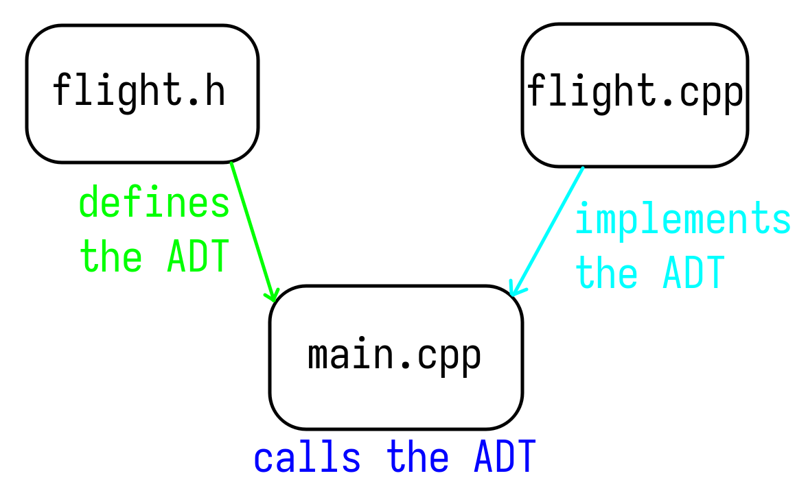
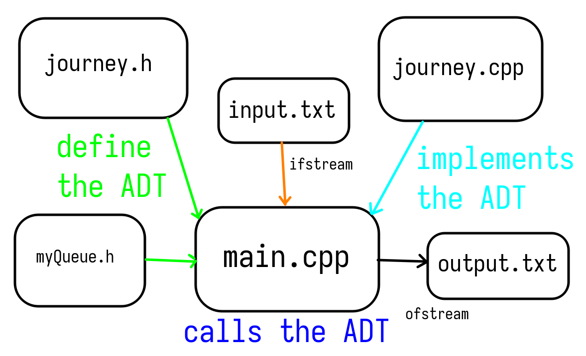
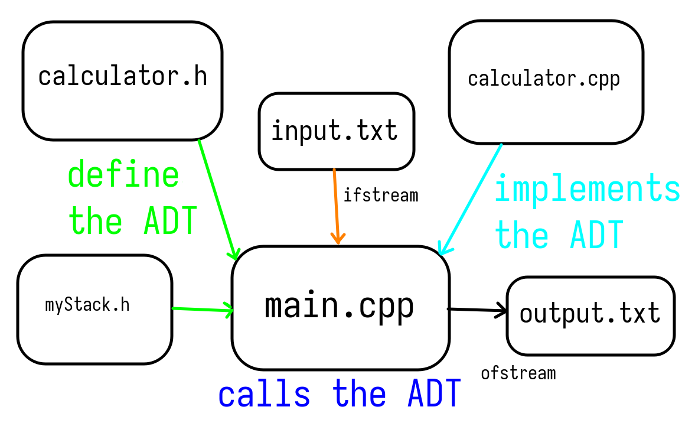

# Big Homework 1 of DSA 2024

## Exercise 1 - Flight Booking System

### 1. Usage

Compile both `main.cpp` and `flight.cpp`, then run the resulting executable. In order to change the passengers of each flight, more calls to the `bookSeat` method may be used within `main.cpp`.

Example using `g++`:

* Compilation: `g++ main.cpp flight.cpp -ggdb`

* Execution: `./a.out` or `./a.exe`

### 2. Structure

Our project follows the convention of separating the implementation, the headers and the main function.

The files are layed out as such:

* `flight.h` contains the definition of the data structure, guarded by preprocessor directives so as to not be included twice

* `flight.cpp` contains the implementation of each of the methods of the data structure

* `main.cpp` contains only the calls to the methods defined and implemented in the aforementioned files

<p align="center">
    
</p>

### 3. Algorithm

The program stores the flight bookings that a user adds in an STL list of string arrays. Even though the STL list can store as many items as memory permits, we impose a maximum number of **5** flights, through `FLIGHT_CAP`, each with a maximum number of **5** seats, defined by the `SIZE` preprocessing directive.

To book a seat, we first check if the current flight is not over the limit of flights, afterwhich we iterate through each non-empty booking. If the booking is empty, we add the seat that we wanted to book. If all seats are free, we automatically book the first seat and add the flight to the list of `flights`.

To cancel a booking, we iterate through the list until we find the desired seat, we clear it, and then we move the passengers from subsequent seats to a spot that is preceeding each one of them.

We display all flights by iterating through the non-empty elements of the list of `Flight` arrays until we reach `FLIGHT_CAP`.

## Exercise 2 - Journey through the Desert

### 1. Usage

Compile both `main.cpp` and `journey.cpp`, then run the resulting executable.

#### Input - input.txt
The user must provide the data as follows:

* First line: number of oases and consumption rate, separated by space

* Second line: amount of water of the oasis and distance to the next one, separated by space

#### Output - output.txt

The output will contain either the closest oasis, identified by its index, a message informing the user that it is impossible to cross the desert, or an error, if the input does not follow the previously mentioned syntax. 

### 2. Structure

The files are layed out as such:

* `myQueue.h` contains the definition of the `Queue` data structure, guarded by preprocessor directives so as to not be included twice

* `journey.h` contains the definition of the data type of the problem, guarded by preprocessor directives so as to not be included twice

* `journey.cpp` contains the implementation of each of the methods of the data structure

* `main.cpp` contains only the calls to the methods defined and implemented in the aforementioned files

<p align="center">
    
</p>

### 3. Algorithm

The program reads the input from `input.txt`, checks it for errors, and then searches for a possible path from the first oasis. If it finds one, it writes it in the `output.txt` file. Otherwise, it enqueues the current oasis and moves to the next one. If it doesn't find a possible path in any of the oases given, it outputs an appropriate message.

## Exercise 3 - Calculator

### 1. Usage

Compile both `main.cpp` and `calculator.cpp`, then run the resulting executable.

#### Input - input.txt
The user must provide the data as follows:

* First line: variable name, equals sign, number, all separated by spaces

* Second line: arithmetic expression

#### Example:

```
A=0
B=9
(B/A)
```

#### Output - output.txt

The output will contain either the result, or an error.

The errors are also streamed to `stderr`, in case `input.txt` could not be opened.

### 2. Structure

The files are layed out as such:

* `myStack.h` contains the definition of the `Stack` data structure, guarded by preprocessor directives so as to not be included twice

* `calculator.h` contains the definition of the data type of the problem, guarded by preprocessor directives so as to not be included twice

* `calculator.cpp` contains the implementation of each of the methods of the data structure

* `main.cpp` contains only the calls to the methods defined and implemented in the aforementioned files

<p align="center">
    
</p>

### 3. Algorithm

The Calculator works by reading from input.txt variables, followed by an expression. The program determines whether the expression is correct by pushing each operator onto an `expressionStack`.

The stack is then analysed and if the operators form a valid expression, the result is computed and written to the output file.

If the operators do not form a valid expression, the user is notified by this through an error both in the output file and in `stderr`.
